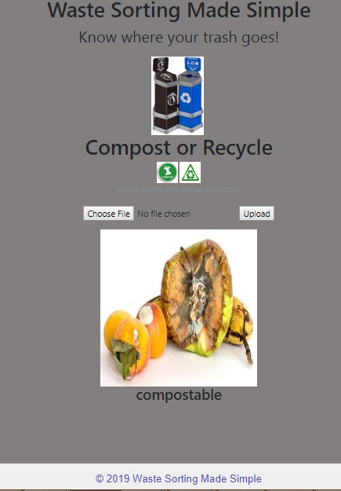

  

## Waste Sorter 
Intrigued by our previous project experience (working on image classifier model for the Neural chef project), we were keen to embark on another mission of image classification. But this time we wanted to build a model which can achieve higher accuracy.

/*WHAT WAS ACHIEVED IN THIS PROJECT?*/

•	We started off with developing an ANN from scratch by training our model to be able to classify between compostable and recyclable items. But the results were average and disappointing. 
•	By making use of a pre-trained model, we kind of taught our model the high-level features of our new images, so it can predict accurately.

We then got the flask working and the web app working. To check the waste sorter working web app, click <a href="https://smart-waste-sorter.herokuapp.com/">here</a>
